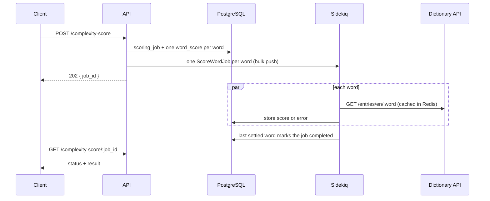
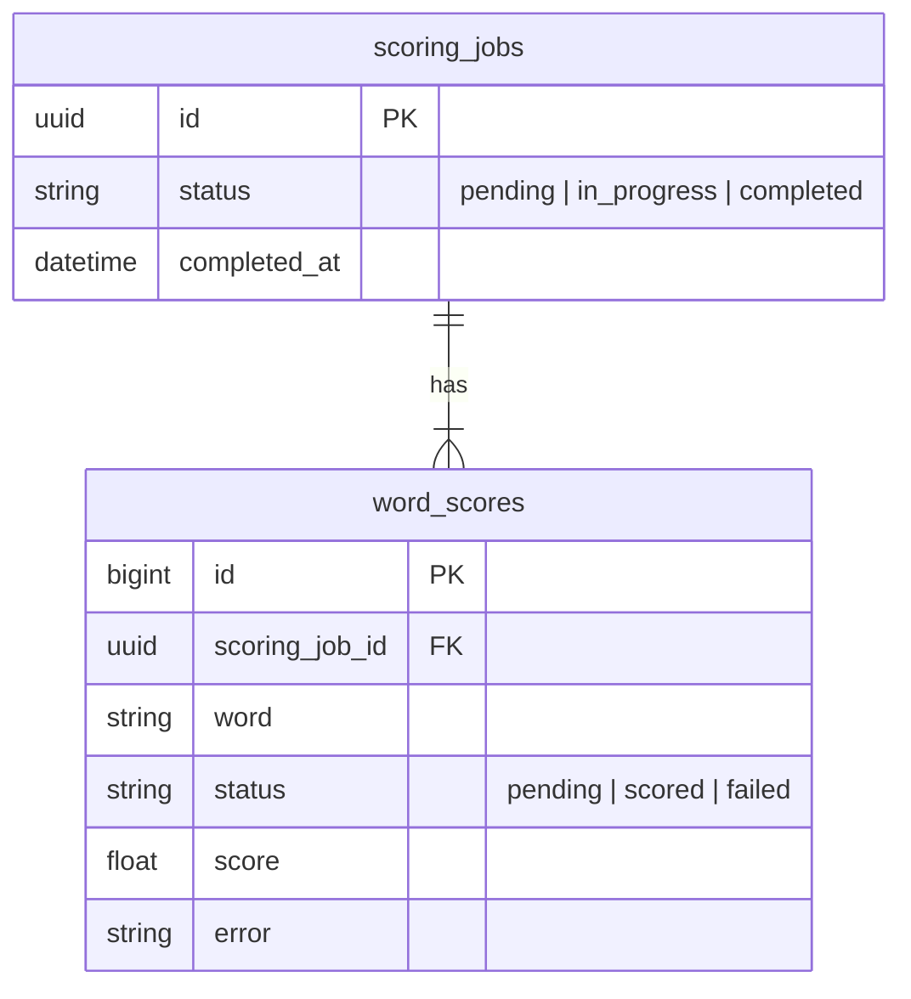
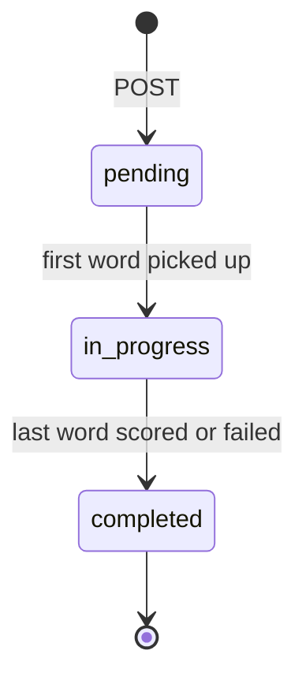

# Architecture

## Components

| Component | Role |
|-----------|------|
| Rails API (Puma) | Validates submissions, stores jobs, enqueues work, serves job status |
| Sidekiq | Runs `ScoreWordJob`, one per word, on the `scoring` queue |
| PostgreSQL | Source of truth for jobs and per-word results |
| Redis | Sidekiq queue and scheduled retries, dictionary cache, rate limit counters |
| Free Dictionary API | Definitions, synonyms and antonyms for a word |

## Request flow

Submitting never waits for the dictionary. The request validates the payload, writes the job with its words in one transaction, pushes all word jobs to Redis in a single round trip and returns `202`.

## Data model

Words are unique within a job, enforced by a unique index on `(scoring_job_id, word)` that also serves every lookup of a job's words. Results are returned in insertion order, which is the order the words were submitted in.

## Job lifecycle

Each word moves from `pending` to either `scored` or `failed`. The job is `completed` once no word is `pending`.

## Concurrency

- **Fan-out per word.** Each word is its own job, so words are fetched in parallel, a slow or failing word doesn't hold up the others, and retries are scoped to a single word.
- **Start.** The first worker flips the job to `in_progress` with a conditional `UPDATE ... WHERE status = 'pending'`, so the transition happens once and can never move a completed job backwards.
- **Completion.** Every word commits its own result first, then takes a row lock on the job and marks it completed if nothing is pending anymore. Whichever worker locks last sees every word settled, so exactly one worker completes the job no matter how they interleave.
- **Throughput.** A worker runs `SIDEKIQ_CONCURRENCY` words at a time (10 by default). Ten uncached words finish in roughly the time of the slowest single lookup; anything beyond that waits in the `scoring` queue. The database pool is sized to match.

## Caching

Dictionary profiles (definition, synonym and antonym counts) are cached in Redis for a week under a versioned key. Once a word is cached, later requests for it don't touch the dictionary.

Missing words and failed lookups are not cached. Lookups of the same uncached word that run at the same moment each go upstream.

## Persistence

Jobs and per-word results live in PostgreSQL and survive restarts of the API, workers and Redis.

Redis holds the queue and scheduled retries, so it has to be persistent: flushing it drops queued words, and their jobs never complete.

## Code map

| Path | Responsibility |
|------|----------------|
| `app/controllers/complexity_scores_controller.rb` | Endpoints, rate limit |
| `app/controllers/application_controller.rb` | Error responses |
| `app/models/word_list.rb` | Payload parsing, validation and normalization |
| `app/models/scoring_job.rb` | Submission, start and completion of a job |
| `app/models/word_score.rb` | Scoring a single word |
| `app/jobs/score_word_job.rb` | Background execution and retry policy |
| `app/models/dictionary.rb` | Cached dictionary lookups |
| `app/models/dictionary/client.rb` | HTTP client and upstream error mapping |
| `app/models/dictionary/profile.rb` | Parsing a dictionary response and computing the score |
| `app/views/complexity_scores/*.json.jbuilder` | Response bodies |

## Possible improvements

- Idempotency keys on `POST` so retried submissions don't create duplicate jobs.
- Progress counter (`scored / total`) and partial results while a job is `in_progress`.
- Short-lived negative cache for missing words, and a lock to avoid concurrent lookups of the same uncached word.
- Periodic sweep that re-enqueues words left `pending` after a lost queue.
- Webhook callback as an alternative to polling.
- Retention job that purges old scoring jobs.
